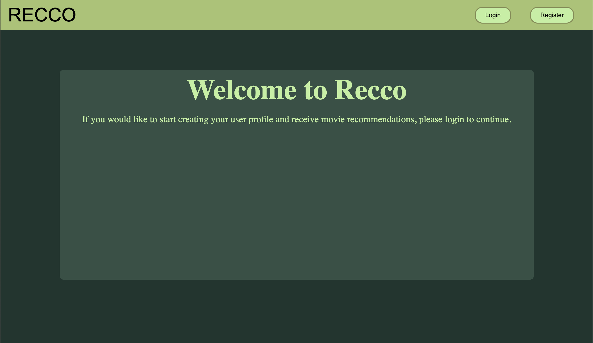
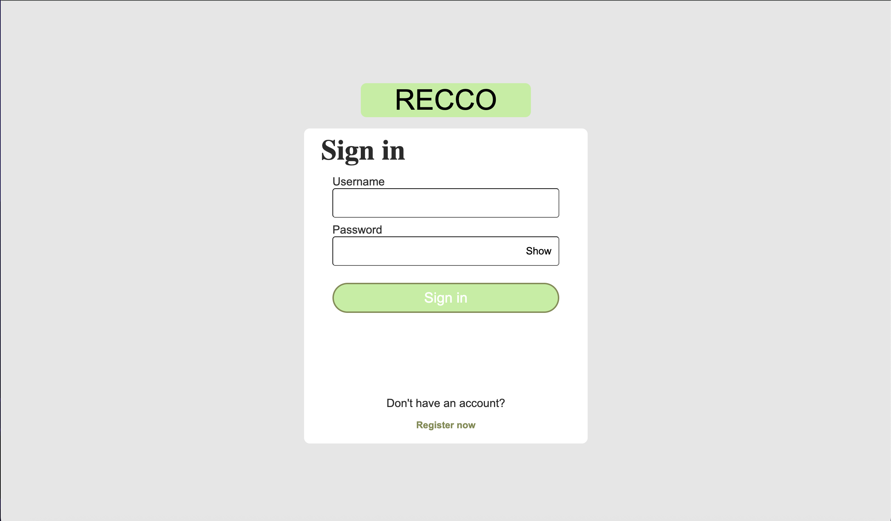
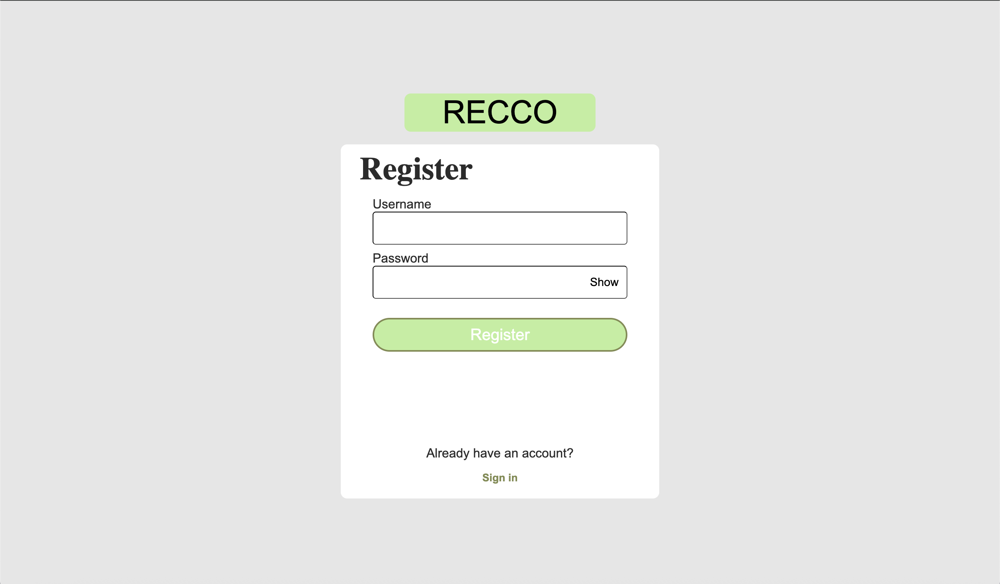
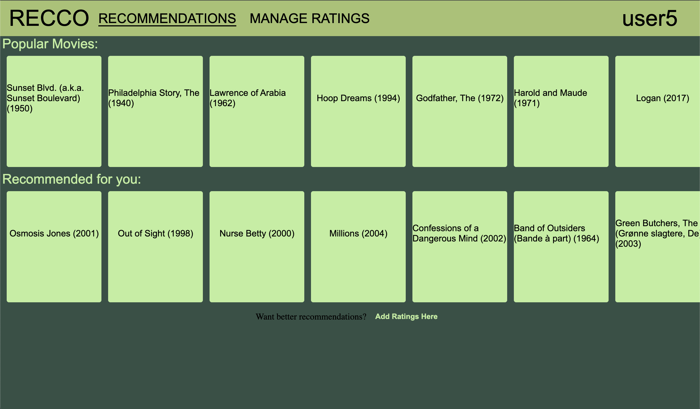
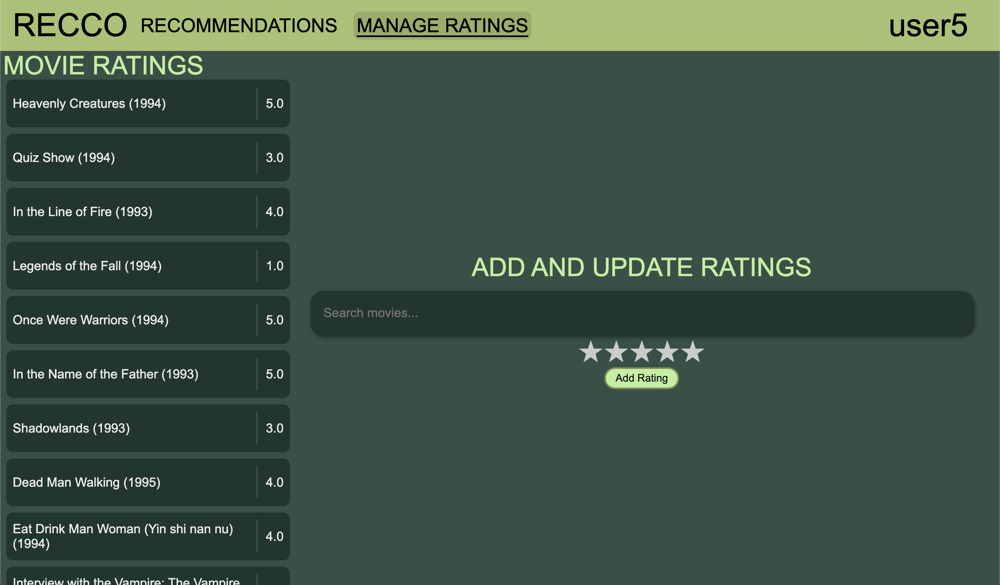

# RECCO: Providing Movie Suggestions Using Content-Based Filtering

RECCO is a movie recommendation system that is designed to serve fast and relevant movie recommendations to users using Content-Based Filtering (CBF). This project uses the MovieLens Latest Small dataset and the movie suggestions are based on movie information that comes from the user's rated movies.

## Dataset
**Source:** [MovieLens Latest Small](https://grouplens.org/datasets/movielens/latest/)  
**Details:** 100,000 ratings and 3,600 tag applications applied to 9,000 movies by 600 users  

## Installation
- Fork or clone the repo
- Create a venv
- Install the project dependencies using the command: `pip install -r path/to/requirements.txt`
    - If you are not on windows, remove `pywin32==310` from the `requirements.txt` file, and save, before pip installing
- Don’t forget to set your interpreter to the venv
- Create a .env file and create a Flask key variable, called `FLASK_SECRET_KEY`, and set it to whatever you like.
- Create a data folder. Download the dataset from the provided link in the Dataset section and store the csv files within the data folder.
- Create the database: Run the three python files in the data_ingestion folder. These are called `create_movies_table.py`, `create_ratings_table.py`, and `create_users_table.py`.

## Usage
- To start the Flask server, run the `app.py` file
- Now you can load the Flask website in your browser by going to the link shown in the console.

## Visuals
### Home

At the moment, the home page is an initial welcome page designed to guide the user to login/register.

### Login

A standard page for logging in. It checks a database to see if the username and password exist.

### Register

Lets the user create a username and password. The login details are then stored in the SQLite database.

### Recommendations

Displays the user's personalized movie recommendations. Also allows the user to quickly add ratings to movies when hovering over a recommendation.

### Manage Ratings

The manage ratings page lets the user add and delete movie ratings. The user can search for movies in the search bar, which will provide autocomplete options based on the movie database.

## Methodology
### Content-Based Filtering (CBF)
The dataset provides a very sparse user-item matrix which can hinder the performance of similarity-based methods, such as User-Based Collaborative Filtering (UBCF) and Item-Based Collaborative Filtering (IBCF). I could have tried a hybrid approach; but I decided to stick with CBF instead.

### Cold Start Problem
I decided to create a separate shelf to display general popular recommendations based on all the ratings in the database. Once a user has added a movie rating, the other shelf of recommendations populates with personalized recommendations. Although the recommendations won't be very good after one movie rating, I thought it would be best to include them regardless.

### Cosine Similarity
Cosine similarity performs well with sparse data, like the dataset I am using.

## Project Status
RECCO is still in development but it is not currently a priority.

## Contributions
Contributions are **NOT** currently being accepted. This was just a personal project, but thank you for considering contributing.

## License
This project is licensed under the MIT License